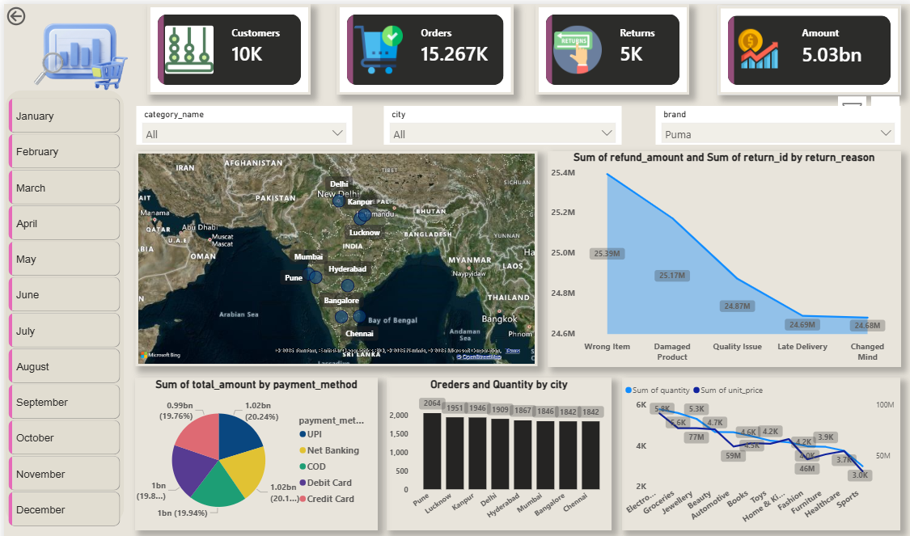

# 🛒 E-Commerce Sales Analysis

<div align="center">



[](https://python.org)
[](https://mysql.com)
[](https://jupyter.org)
[](https://pandas.pydata.org)

**A complete end-to-end E-Commerce Sales Analysis using Python & MySQL**

</div>

---

## 📌 Project Overview

This project performs a **comprehensive analysis of e-commerce sales data** using Python and MySQL. It covers everything from data extraction and cleaning to advanced visualizations and business insights — helping understand customer behavior, product performance, and revenue trends.

---

## 🗂️ Project Structure

```
ecommerce-sales-analysis-using-powerBI/
│
└── ecommerce-sales-analysis/
    ├── 📁 datasets/
    │   ├── categories_large.csv
    │   ├── customers_large.csv
    │   ├── order_items_large.csv
    │   ├── orders_large.csv
    │   ├── products_large.csv
    │   └── returns_large.csv
    │
    ├── 📁 screenshots/
    │   └── (Dashboard & analysis screenshots)
    │
    ├── 📓 ecommerce-sales-analysis.ipynb
    └── 🖼️ ecommerce-sales-dashboard.png
```

---

## 📊 Datasets Used

| File | Description |
|------|-------------|
| `customers_large.csv` | Customer details and demographics |
| `orders_large.csv` | Order history with dates and status |
| `order_items_large.csv` | Individual items per order |
| `products_large.csv` | Product catalog with pricing |
| `categories_large.csv` | Product category mapping |
| `returns_large.csv` | Return records and reasons |

---

## 🔍 Key Analysis Performed

- 📈 **Revenue Trends** — Monthly and yearly sales performance
- 👥 **Customer Segmentation** — Top customers by revenue
- 🏆 **Top Performing Products** — Best-selling items and categories
- 🔄 **Return Analysis** — Return rates and patterns
- 🌍 **Regional Sales** — Geographic distribution of orders
- 📦 **Order Status Breakdown** — Delivered, pending, returned
- 💰 **Profit & Loss Insights** — Margin analysis per category

---

## 🛠️ Tech Stack

| Tool | Purpose |
|------|---------|
| **Python 3.8+** | Core programming language |
| **MySQL 8.0+** | Database for data storage & querying |
| **Pandas** | Data manipulation and analysis |
| **Matplotlib / Seaborn** | Data visualization |
| **Jupyter Notebook** | Interactive analysis environment |

---

## 🚀 How to Run

### Prerequisites
```bash
pip install pandas matplotlib seaborn mysql-connector-python jupyter
```

### Steps

1. **Clone the repository**
```bash
git clone https://github.com/codebyavneesh/ecommerce-sales-analysis-using-powerBI.git
cd ecommerce-sales-analysis-using-powerBI
```

2. **Setup MySQL Database**
```sql
CREATE DATABASE ecommerce_db;
```

3. **Open Jupyter Notebook**
```bash
jupyter notebook ecommerce-sales-analysis/ecommerce-sales-analysis.ipynb
```

4. **Run all cells** and explore the analysis!

---

## 📸 Screenshots

> Check the `screenshots/` folder for full dashboard and analysis visuals.

---

## 🤝 Connect with Me

<div align="center">

| Platform | Link |
|----------|------|
| 💼 **LinkedIn** | [linkedin.com/in/codebyavneesh](https://linkedin.com/in/codebyavneesh) |
| 📧 **Email** | [avneesh.codes@gmail.com](mailto:avneesh.codes@gmail.com) |
| 🐙 **GitHub** | [github.com/codebyavneesh](https://github.com/codebyavneesh) |

</div>

---

## 👨‍💻 Author

<div align="center">

**codebyavneesh**

*Data Analyst | Python Developer | MySQL Enthusiast*

⭐ **Agar yeh project helpful laga toh repo ko Star zaroor karein!** ⭐

</div>

---

<div align="center">
<sub>Made with ❤️ by <a href="https://linkedin.com/in/codebyavneesh">codebyavneesh</a></sub>
</div>
